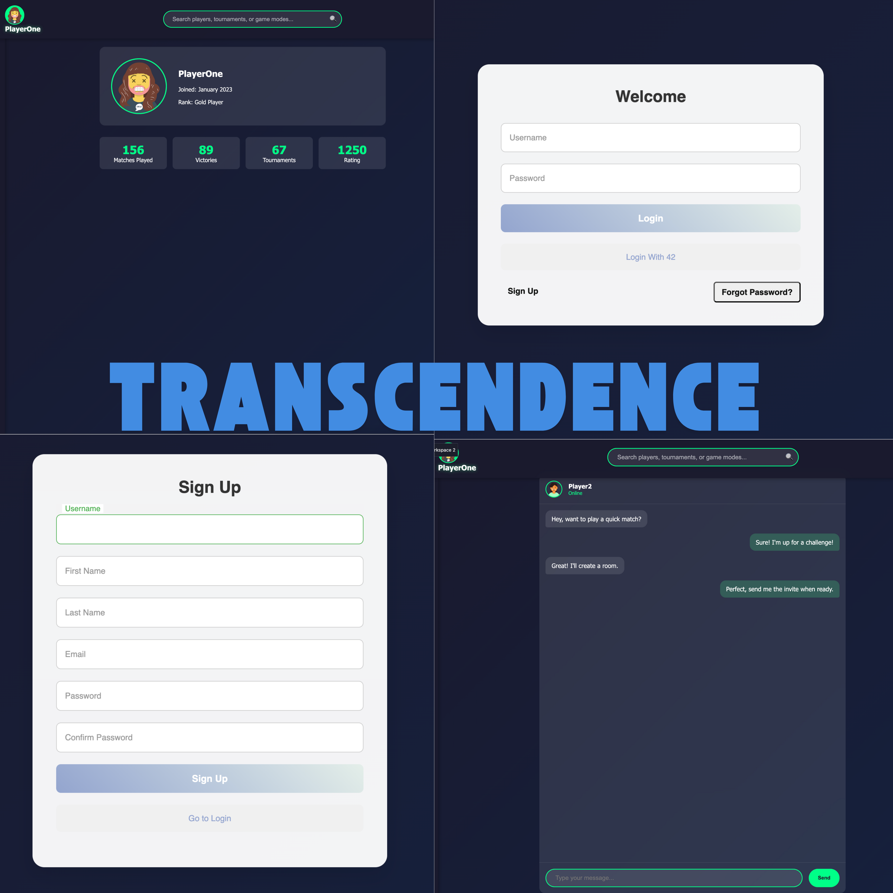

<div align="center">

# 🎨 Personal Portfolio Website

[](https://nellaoui.github.io/portfolio)
[](LICENSE)

A modern, responsive portfolio website showcasing my work and professional journey.

[Live Demo](#) • [Features](#features) • [Installation](#installation) • [Technologies](#technologies)



</div>

## ✨ Features

- 🌓 Dark/Light theme toggle
- 📱 Fully responsive design
- 🎯 Clean and modern UI
- 📂 Project showcase
- 📄 Downloadable resume
- 🎨 Custom color schemes

## 🛠️ Technologies Used

- HTML5
- CSS3
- JavaScript
- Responsive Design
- CSS Custom Properties
- CSS Grid & Flexbox

## 📂 Project Structure

```
portfolio/
├── 📁 css/                  # Styling files
│   ├── style.css           # Main styles
│   ├── dark-theme.css      # Dark theme styles
│   └── skins/              # Color schemes
│       └── color-1.css     
├── 📁 data/                 # Static files
│   └── NoamanElAllaouiResume.pdf
├── 📁 images/               # Image assets
│   ├── donpha.png          # Profile image
│   └── portfolio/          # Project images
└── 📁 js/                   # JavaScript files
    └── script.js           # Main functionality
```

## 🚀 Getting Started

1. **Clone the repository**
```bash
git clone https://github.com/Nellaoui/portfolio.git
cd portfolio
```

2. **Open in browser**
- Simply open `index.html` in your preferred browser
- Or use a local development server:
```bash
# Using Python
python -m http.server 8000

# Using Node.js
npx serve
```

## 🎨 Customization

### Themes
- Toggle between light and dark themes using the theme switcher
- Theme preferences are saved in local storage

### Colors
- Custom color schemes available in `css/skins/`
- Easily add new color schemes by creating additional CSS files

## 📱 Responsive Design

The portfolio is fully responsive and optimized for:
- 📱 Mobile devices
- 💻 Tablets
- 🖥️ Desktop screens

## 👤 Author

<div align="center">
    <a href="https://github.com/Nellaoui">
        
    </a>
    <h3>Noaman El Allaoui</h3>
    <a href="https://github.com/Nellaoui">
        
    </a>
</div>

---

<div align="center">
    <p>Made with ❤️ by Noaman El Allaoui</p>
</div>
